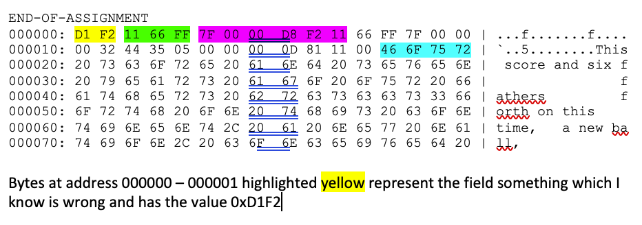

# CSC415-Assignment2-BufferAndStruct

**Assignment 2 – Buffering and Structures**

Welcome to your second homework assignment.  

Let me remind you of the expectations.  Code should be neat, well documented.  Variables should have meaningful names and be in a consistent format (I do not care if you use camelCase or under_scores in variables but be consistent.  Maximum line length in your code is 100 characters.  In addition, each file should have a standard header as defined below.

```
/**************************************************************
* Class:  CSC-415-0# Summer 2022
* Name: Abbas Mahdavi   
* Student ID: 9182***420
* GitHub UserID: AbbasMahdavi021
* Project: Assignment 2 – Stucture in Memory and Buffering
*
* File: Mahdavi_Abbas_HW2_main.c
*
* Description: Dynamic Allocation and Populating of personInfo
Structure: Implementation Project Utilizing Structures, 
Pointers, Strings, Enums, Bitmaps, and Data Buffering.
*
**************************************************************/
```

This is an INDIVIDUAL assignment.  You can (and should) work in groups to research how to do the assignment, but each person should code their own version and make their own submission.

This assignment will give you experience using structures, pointers, character strings, enumerated types, bitmap fields, and buffering data into blocks.  The files assignment2.h and assignment2.o are required for this assignment.  The functions listed in assignment2.h (`writePersonalInfo`, `getNext`, `commitBlock`, and `checkIt`) have been written for you and are the functions in assignment2.o (you do not have the source code that builds that object file).  **Do not** re-implement those functions.

**Step one** - read the assignment carefully and fully.  Do each step and don't read more into it then is there.

**Step two** of this assignment is to review the provided header file assignmet2.h.  You will see a large number of #define statments the represent different computer lanaguages. Then there is a stucture called personalInfo.  This is the structure you will allocate and populate.  Next there is a #define of BLOCK_SIZE set to 256 this is going to be your buffer size to transform byte data into block data.  Finally there are the prototypes for 4 functions that you will need and are described in the steps below.  Note that the functions are implemented in provided assignment2.o file, you do not implement them.

**Step three** is to remember some of the rules.  Name your c file according to our standard of `lastname_firstname_HW1_main.c`, edit the Makefile to enter your FIRST and LAST name (this Makefile is a little different then the first one - do not change anything other than the variables FIRSTNAME and LASTNAME).  Make sure to comment your code, have the standard header.  Remember that for every malloc, there must also be a corresponding free.  Use printf's to debug your program.  In keeping code neat and readable, lines in your program (including commments) should be kept to about 80 characters long but never more than 100 characters. 

*Now what is the coding portion of this assignment...*

**Step four** is to allocate (using malloc) an instantiation of the personInfo structure and to populate it.  The firstName and the lastName are populated from the 1st and second command line argument.  You will then assign your student ID to the studentID field, you will populate the level (gradelevel) appropriately.  You will then populate the languages field.  To do so, specify every language you have Knowledge of and there must be at least three (by definition, with the prerequisites for the course you should at least know some Java, C++, some assembler and of course now C.  But, include all you have knowledge of.  The last part of populating the structure is to copy the third command line parameter to the message field.  Do note the length of the message field.

**Step five** is to "write" your personal information structure by calling `writePersonalInfo` which is one of the function prototypes in the assignment2.h file.  The return value from the function is 0 if it succeeds.

**Step six** involves getting a series of C stings (you do not know how many or how long each one it or what it contains).  You get these strings by calling the function `getNext`.  The return value is a char * (C string).  If the return value is NULL then you have finished.  You will copy the contents of each of those strings into a buffer (block) that is BLOCK_SIZE (use malloc to allocate the buffer), as the buffer is filled you will commit the buffer by calling `commitBlock` passing in the pointer to your BLOCK_SIZE buffer.  

**Step seven** if the final coding step.  Call the function `checkIt`, then exit main returning the same value as returned from `checkIt`.

**Step eight** is dependent on `checkIt` running correctly and displays some binary data which is the personalInfo structure.  You are to describe what each element is, use the structure as reference and show the values and how to read those values.  i.e. which bytes are the student ID, what is it's hexadecimal value and if that is converted to decimal is it correct?  Use color highlights and start and end addresses to describe each element from the hexdump output.

The following is an example (with incorrect selections) to give you the idea of what your analysis should look like.



Do a writeup (using the template) in PDF format that includes a description of what you did and the compilation and execution output from your program and an _analysis_ of the output as specified in step eight.


You should submit your source code file(s) and Makefile, along with a writeup in PDF in GitHub, and the PDF also in Canvas.

Your main program filenames should be `<lastname>_<firstname>HW<#>_<optional>.<proper extension>`


**Rubric**

| Grade Item                    | Grade Points                                  |
|:------------------------------|----------------------------------------------:|
| Standard Header               |   2                                           |
| Command Arguments             |   5                                           |
| Proper use of malloc and free |  10                                           |
| Proper population of personalInfo           |  10                             |
| Proper buffering              |  20                                           |
| Proper use of KNOWLEDGE #defines  |   5                                           |
| Correct Output                |   5                                           |
| Code Comments                 |   5                                           |
| Writeup                       |   8 (Description, Compilation, Sample Output) |
| Writeup analysis              |  10                                           |


## Sample Output:

This output is just what is printed from `checkIt` You can also print out the structure and information
prior to calling `checkIt`.
(Some of the data below has been altered, so your output will be different)

```
------------------------------------ CHECK ------------------------------------
Running the check for Robert Bierman
Name check is 0 by 0
Student ID: 900000000, Grade Level: Instructor
Languages: FFFFFF
Message:
There will be a message printed here 

The Check Succeded (0, 0)

END-OF-ASSIGNMENT
000000: D1 F2 11 66 FF 7F 00 00  D8 F2 11 66 FF 7F 00 00 | ...f.......f....
000010: 00 32 44 35 05 00 00 00  0D 81 11 00 46 6F 75 72 | `..5........This
000020: 20 73 63 6F 72 65 20 61  6E 64 20 73 65 76 65 6E |  score and six f
000030: 20 79 65 61 72 73 20 61  67 6F 20 6F 75 72 20 66 |                f
000040: 61 74 68 65 72 73 20 62  72 63 73 63 63 73 33 66 | athers         f
000050: 6F 72 74 68 20 6F 6E 20  74 68 69 73 20 63 6F 6E | orth on this    
000060: 74 69 6E 65 6E 74 2C 20  61 20 6E 65 77 20 6E 61 | time,   a new ba
000070: 74 69 6F 6E 2C 20 63 6F  6E 63 65 69 76 65 64 20 | ll,             
```
